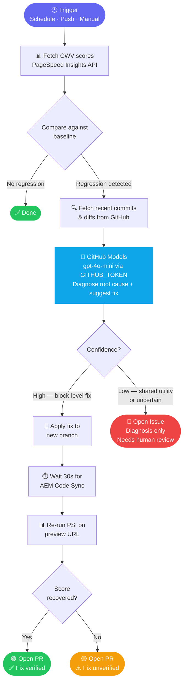

# aem-eds-cwv-agent

> Automated Core Web Vitals regression detection and repair agent for Adobe Edge Delivery Services sites.

[](https://github.com/neeraj10raja/aem-eds-cwv-agent/actions/workflows/perf-regression.yml)


---

## The Problem

A developer pushes code on Tuesday. By Wednesday, the homepage is loading 2 seconds slower for real users. Nobody notices. Hours pass. A teammate eventually sits down, opens DevTools, runs Lighthouse manually, digs through git history — it takes hours to find the one line that caused it.

**This agent closes that loop automatically.**

---

## How It Works



---

## Key Design Decisions

| Decision | Why |
|---|---|
| **Real PSI data, not lab tests** | Catches regressions on real devices and networks that synthetic tests miss |
| **GitHub Models via `GITHUB_TOKEN`** | Zero additional API keys — every GitHub Action already has this token |
| **Verify fix before opening PR** | Every PR the agent opens is already confirmed to improve scores |
| **Never auto-merge** | Code changes can have side effects beyond performance — a human makes the final call |
| **Block-level fixes only** | Shared utilities have wide blast radius — the agent escalates those to a human |
| **One PR per root cause** | Easier to review, revert, and merge incrementally |

---

## Zero-Cost Stack

| Component | Solution | Cost |
|---|---|---|
| Performance monitoring | PageSpeed Insights (unauthenticated) | Free |
| AI diagnosis + fix | GitHub Models `gpt-4o-mini` via `GITHUB_TOKEN` | Free |
| Branch + PR creation | GitHub REST API via `GITHUB_TOKEN` | Free |
| Baseline storage | JSON committed to `.github/baselines/` | Free |
| CI runner | GitHub Actions | Free |

---

## Quick Start

### 1. Copy the workflow into your EDS repo

```bash
cp .github/workflows/perf-regression.yml your-eds-repo/.github/workflows/
```

### 2. Copy and configure `perf-agent.config.json`

```bash
cp perf-agent.config.example.json your-eds-repo/perf-agent.config.json
```

Edit the paths you want to monitor:

```json
{
  "paths": ["/", "/products", "/about"],
  "strategy": "mobile",
  "thresholds": {
    "lcp_increase_ms": 500,
    "score_drop": 5
  },
  "lookback_hours": 48
}
```

### 3. Copy the agent source

```bash
cp -r perf-agent/ your-eds-repo/perf-agent/
cp .github/baselines/performance.json your-eds-repo/.github/baselines/performance.json
```

### 4. Enable workflow permissions

In your repo: **Settings → Actions → General → Workflow permissions**
- Enable **"Allow GitHub Actions to create and approve pull requests"**

### 5. Seed the baseline

Trigger the workflow manually with **Update baseline = true**. This stores your current scores as the reference point. Commit the updated `performance.json`.

That's it. The agent will now run every 6 hours.

---

## Configuration

### `perf-agent.config.json`

| Field | Description | Default |
|---|---|---|
| `paths` | URL paths to monitor | `["/"]` |
| `strategy` | `"mobile"` or `"desktop"` | `"mobile"` |
| `thresholds.lcp_increase_ms` | LCP increase (ms) that triggers investigation | `500` |
| `thresholds.score_drop` | Performance score drop that triggers investigation | `5` |
| `lookback_hours` | How far back to look in git history | `48` |

### Environment variables

| Variable | Required | Description |
|---|---|---|
| `GITHUB_TOKEN` | ✅ Auto-injected | Creates branches, PRs, issues — no setup needed |
| `REPO_OWNER` | ✅ Auto-injected | GitHub username / org |
| `REPO_NAME` | ✅ Auto-injected | Repository name |
| `PSI_API_KEY` | Optional | Adds a Google API key for higher PSI rate limits |
| `DRY_RUN` | Optional | Set `true` to log everything without creating PRs or issues |

---

## Running Locally

```bash
npm install

# Dry run — logs scores and any regressions, creates nothing
REPO_OWNER=your-org REPO_NAME=your-repo GITHUB_TOKEN=your-token DRY_RUN=true \
  node perf-agent/index.js

# Update the baseline to current scores
REPO_OWNER=your-org REPO_NAME=your-repo GITHUB_TOKEN=your-token \
  node perf-agent/index.js --update-baseline
```

---

## What the Agent Will Never Do

- Merge a pull request
- Modify `scripts/aem.js`
- Touch shared utility files when it's uncertain
- Create duplicate PRs for the same regression
- Run without a `GITHUB_TOKEN`

---

## Project Structure

```
perf-agent/
├── index.js       # Orchestrator — runs the full detection loop
├── psi.js         # PageSpeed Insights client
├── baseline.js    # Load, compare, and save performance baselines
├── diagnose.js    # GitHub Models integration — diagnosis and fix generation
├── github-api.js  # GitHub REST client (no SDK, plain fetch)
└── fix.js         # Apply fix to branch, verify on AEM preview URL

.github/
├── baselines/
│   └── performance.json     # Committed baseline scores
└── workflows/
    └── perf-regression.yml  # GitHub Actions workflow
```

---

## License

Apache 2.0 — see [LICENSE](LICENSE)
