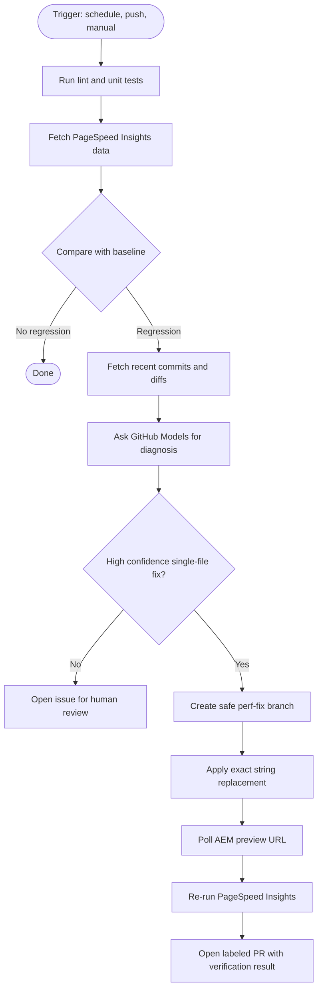

# aem-eds-cwv-agent

> Production-hardened Core Web Vitals regression detection and repair agent for Adobe Edge Delivery Services sites.

[](https://github.com/neeraj10raja/aem-eds-cwv-agent/actions/workflows/perf-regression.yml)


---

## What This Does

This agent watches an Adobe Edge Delivery Services site for performance regressions.

When a page gets slower, it:

1. Runs PageSpeed Insights for configured URLs.
2. Compares the current Lighthouse performance data with a committed baseline.
3. Looks at recent GitHub commits.
4. Uses GitHub Models to diagnose the likely cause.
5. Opens a human-review issue by default.
6. Polls the AEM preview URL until the new branch is live.
7. If `auto_fix_enabled` is explicitly enabled, applies a safe single-file fix, tests it, and opens a labeled PR.

The agent never merges code. A human still reviews every issue and PR.

---

## Important AEM EDS Terms

**AEM** means Adobe Experience Manager.

**Edge Delivery Services** is Adobe's fast site delivery layer for AEM-backed sites. Code usually lives in GitHub, content can come from documents or AEM authoring, and pages are delivered through Adobe's edge network.

**AEM preview URL** is the temporary URL for a Git branch:

```text
https://branch--repo--owner.aem.page
```

This agent creates a DNS-safe branch name and verifies that preview URL before running the second performance check.

**Core Web Vitals** are Google's main page-experience metrics:

| Metric | Meaning |
|---|---|
| `LCP` | How fast the main visible content appears. Good target: 2500ms or less |
| `INP` | How quickly the page responds to user input. Good target: 200ms or less |
| `CLS` | How much the layout shifts while loading. Good target: 0.1 or less |

This agent stores and compares Lighthouse/PageSpeed data. It is useful for regression detection, but it should not be treated as a perfect replacement for real-user monitoring.

---

## How It Works



---

## Production Hardening Included

| Area | What is handled |
|---|---|
| Duplicate PRs | PRs get a `perf-regression` label, and open PRs are also checked by branch prefix |
| Duplicate issues | Human-review issues are deduped by label and title |
| CWV thresholds | Flags both regressions and absolute bad LCP/INP/CLS values |
| AEM Code Sync | The agent polls the preview URL instead of sleeping for a fixed 30 seconds |
| Preview branch names | Generated branch names avoid slashes so they work inside `*.aem.page` hostnames |
| PSI reliability | `PSI_API_KEY` is required for normal production runs, with retry/backoff |
| GitHub reliability | GitHub API calls retry transient failures |
| Model quality | Default model is `gpt-4o`, configurable in `perf-agent.config.json` |
| Enterprise safety | AI diagnosis can be disabled, and AI code fixes are opt-in |
| Large diffs | Truncated diffs force low-confidence diagnosis |
| Custom domains | `site_url` lets teams monitor production or custom domains, not only `*.aem.page` |
| CI safety | Lint and unit tests run before the agent |
| Agent failures | Workflow failures create or update a GitHub issue |

---

## Setup

For enterprise rollout patterns, see [docs/enterprise-integration.md](docs/enterprise-integration.md).

### Install

Clone this repo, then run the installer pointing at your EDS repo:

```bash
git clone https://github.com/neeraj10raja/aem-eds-cwv-agent
cd aem-eds-cwv-agent
node scripts/install.js --target /path/to/your-eds-repo --paths /,/blog
```

For a custom production domain:

```bash
node scripts/install.js \
  --target /path/to/your-eds-repo \
  --site-url https://www.example.com \
  --paths /,/blog,/products
```

This copies into your EDS repo:

```text
perf-agent/
perf-agent.config.json
.github/workflows/perf-regression.yml
.github/baselines/performance.json
```

Safe default: `auto_fix_enabled` is `false`, so it opens issues and does not create AI-generated fix PRs.

### GitHub Setup (required for both install paths)

**1. Add the PSI API key**

Get a free key at `console.cloud.google.com` → enable **PageSpeed Insights API** → Credentials → Create API Key.

In your EDS repo: **Settings → Secrets and variables → Actions → New repository secret**
- Name: `PSI_API_KEY`
- Value: your key

**2. Enable Actions write permissions**

In your EDS repo: **Settings → Actions → General → Workflow permissions**
- Select **Read and write permissions**
- Check **Allow GitHub Actions to create and approve pull requests**

The built-in `GITHUB_TOKEN` is used automatically for GitHub API calls and GitHub Models — no extra setup needed.

**3. Seed the baseline**

Go to **Actions → Performance Regression Detection → Run workflow**, set `update_baseline` to `true`, and click Run.

This hits PSI for your real pages and saves the current scores as the starting baseline. Future runs compare against these.

That is it. The agent runs automatically every 6 hours and on every push to main from here.

### Manual Install

Use this only if your enterprise repo needs custom file placement.

Copy the workflow:

```bash
cp .github/workflows/perf-regression.yml your-eds-repo/.github/workflows/
```

Copy the agent:

```bash
cp -r perf-agent/ your-eds-repo/perf-agent/
cp perf-agent.config.example.json your-eds-repo/perf-agent.config.json
cp .github/baselines/performance.json your-eds-repo/.github/baselines/performance.json
```

Configure the site:

```json
{
  "site_url": "https://www.example.com",
  "paths": ["/", "/products", "/about"],
  "strategy": "mobile",
  "thresholds": {
    "lcp_good_ms": 2500,
    "inp_good_ms": 200,
    "cls_good": 0.1,
    "lcp_increase_ms": 500,
    "score_drop": 5
  },
  "lookback_hours": 48,
  "default_branch": "main",
  "model": "gpt-4o",
  "ai_diagnosis_enabled": true,
  "auto_fix_enabled": false,
  "require_psi_api_key": true,
  "preview_poll": {
    "timeout_ms": 180000,
    "interval_ms": 10000
  }
}
```

If your organization does not allow source diffs to be sent to GitHub Models, set `ai_diagnosis_enabled: false` in your config. To opt into AI fix PRs after governance review, set `auto_fix_enabled: true`.

---

## Configuration

| Field | Description | Default |
|---|---|---|
| `site_url` | Base URL to test. Use your production/custom domain, or omit for AEM `*.aem.page` | `https://main--repo--owner.aem.page` |
| `paths` | URL paths to monitor | `["/"]` |
| `strategy` | PageSpeed strategy: `mobile` or `desktop` | `mobile` |
| `thresholds.lcp_good_ms` | Absolute LCP good threshold | `2500` |
| `thresholds.inp_good_ms` | Absolute INP good threshold | `200` |
| `thresholds.cls_good` | Absolute CLS good threshold | `0.1` |
| `thresholds.lcp_increase_ms` | LCP increase that triggers investigation | `500` |
| `thresholds.score_drop` | Performance score drop that triggers investigation | `5` |
| `lookback_hours` | How far back to inspect commits | `48` |
| `default_branch` | Base branch for fixes and default AEM preview URL | `main` |
| `model` | GitHub Models model used for diagnosis/fix generation | `gpt-4o` |
| `ai_diagnosis_enabled` | Send regression context and recent diffs to GitHub Models for diagnosis | `true` |
| `auto_fix_enabled` | Allow the agent to create AI-generated fix branches and PRs | `false` |
| `require_psi_api_key` | Require `PSI_API_KEY` unless `DRY_RUN=true` | `true` |
| `preview_poll.timeout_ms` | Max time to wait for AEM preview branch to go live | `180000` |
| `preview_poll.interval_ms` | Delay between preview checks | `10000` |

---

## Running Locally

```bash
npm install
npm test
npm run lint
```

Dry run:

```bash
REPO_OWNER=your-org REPO_NAME=your-repo GITHUB_TOKEN=your-token DRY_RUN=true \
  node perf-agent/index.js
```

Production-like run:

```bash
REPO_OWNER=your-org REPO_NAME=your-repo GITHUB_TOKEN=your-token PSI_API_KEY=your-key \
  node perf-agent/index.js
```

Update baseline:

```bash
REPO_OWNER=your-org REPO_NAME=your-repo GITHUB_TOKEN=your-token PSI_API_KEY=your-key \
  node perf-agent/index.js --update-baseline
```

---

## What The Agent Will Not Do

- It will not merge pull requests.
- It will not create AI-generated fix PRs unless `auto_fix_enabled` is `true`.
- It will not modify `scripts/aem.js`.
- It will not modify files outside `blocks/` or `scripts/`.
- It will not auto-fix when diffs are truncated.
- It will not auto-fix broad/shared utility changes.
- It will not run production mode without `GITHUB_TOKEN`.
- It will not run production mode without `PSI_API_KEY`, unless `require_psi_api_key` is set to `false`.

---

## Current Limits

This is now hardened enough to install in a real repo behind human review, but it is still not a magic autopilot.

Known limits:

- PageSpeed/Lighthouse data can be noisy.
- Real-user monitoring is still recommended for important production sites.
- AI fixes are limited to exact string replacements.
- Complex regressions intentionally become issues instead of automatic PRs.
- Model and API quotas still matter for large teams.

That is by design: the agent should reduce investigation time without taking unsafe control of the codebase.

---

## Project Structure

```text
perf-agent/
├── index.js       # Orchestrator
├── psi.js         # PageSpeed Insights client
├── baseline.js    # Load, compare, and save baselines
├── diagnose.js    # GitHub Models integration
├── github-api.js  # GitHub REST client
└── fix.js         # Apply fix and verify preview

scripts/
└── install.js     # One-command installer for EDS repos

test/
├── baseline.test.js
├── diagnose.test.js
├── fix.test.js
├── github-api.test.js
└── psi.test.js

.github/
├── baselines/performance.json
└── workflows/
    ├── ci.yml
    └── perf-regression.yml

docs/
└── enterprise-integration.md
```

---

## License

Apache 2.0. See [LICENSE](LICENSE).
